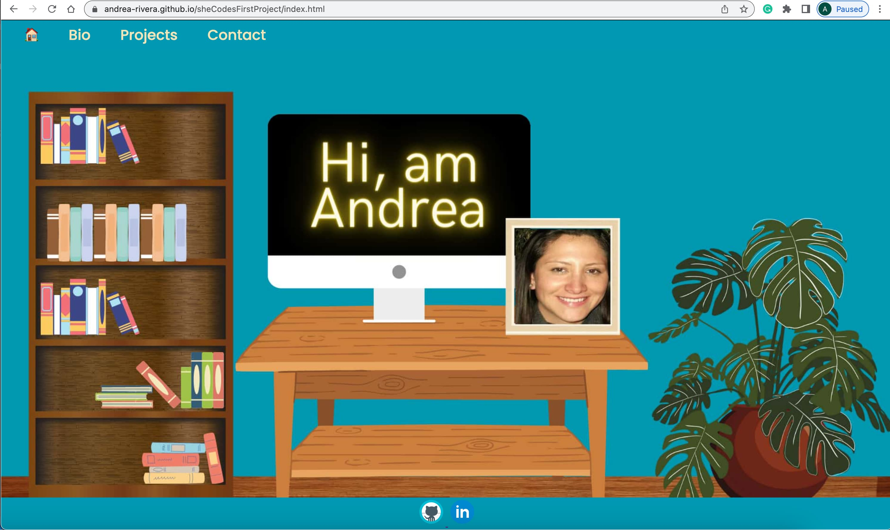
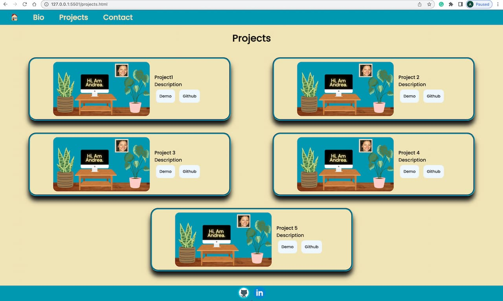

#  Andrea del Pilar Rivera Pena- Portfolio Task
[My portfolio site]( https://andrea-rivera.github.io/sheCodesFirstProject/index.html)
## Project Requirements
### Content
My profile picture is inside a canvas picture that I used as my hero section. I have done one image for desktop and another image for mobile. 
My Biography tells my history and although it is a little bit lengthy it is worth reading.
My Contact form has three inputs name, email and message and also has a footer where the user can go to my GitHub account or my LinkedIn profile.
My projects section at the moment has only cards that are placeholders for future projects.
- [x] At least one profile picture
- [x] Biography (at least 100 words)
- [x] Functional Contact Form
- [x] "Projects" section
- [x] Links to external sites, e.g. GitHub and LinkedIn.
### Technical
My webpage has an index page and it has links to three pages: Bio, Projects and Contact. 
I have also deployed a GitHub page where you can see my webpage Live. At the moment,I have implemented responsiveness for desktop and mobile view. Finally, I have used semantic HTML tags like header,section and article.
- [x] At least 2 web pages.
- [x] Version controlled with Git
- [x] Deployed on GitHub pages.
- [x] Implements responsive design principles.
- [x] Uses semantic HTML.
### Bonus (optional)
I have used the hover state to give life to my buttons . For example, in my projects section I have two buttons: Github and Demo . If you hover over them it will activate the css effect for border-shadow , translate and to change the color of the border.
- [x] Different styles for active, hover and focus states.
### Screenshots
> Please include the following:
> - The different pages and features of your website on mobile, tablet and
desktop screen sizes (multiple screenshots per page and screen size).
##Desktop Size

> - The different features of your site, e.g. if you have hover states, take a
screenshot that shows that.

